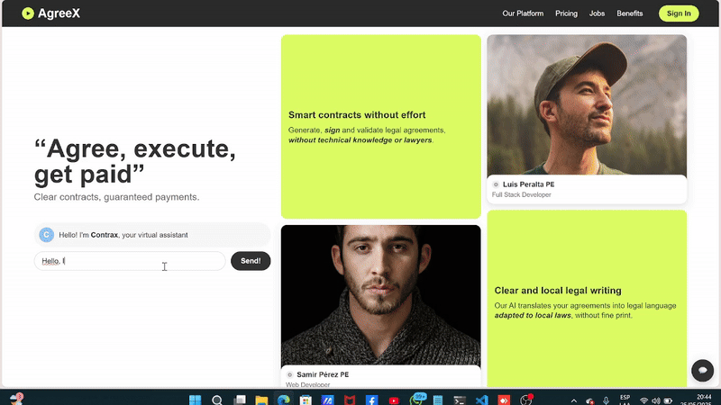

# AgreeX - Powered by OKX DEX

## Project Description
AgreeX is an "all-in-one" platform that **generates, verifies, signs, and custodies smart contracts** between freelancers and contractors, using multi-chain blockchain technology and multiple artificial intelligence agents. The platform integrates **OKX DEX Aggregator v5** to enable payments in any token and automatically releases funds when deliverables meet agreed requirements.

Developed for the **OKX Hackathon 2025**, AgreeX revolutionizes freelance work through OKX DEX ecosystem integration, enabling cross-chain transactions and automatic token swaps for maximum payment flexibility.

## Problem We Solve
Freelancers, especially newcomers, often make verbal agreements or use ambiguous contracts, leading to risks of:
- Late or non-payment
- Unilateral changes to terms
- Disputes over deliverables
- Lack of legal guarantees

## Value Proposition
AgreeX with OKX DEX enables any freelancer or contractor to:
- Create solid contracts in minutes on multiple blockchains
- Validate identities seamlessly using decentralized technology
- Receive/release payments in any token via OKX DEX
- Execute automatic swaps to pay in preferred tokens
- Operate on 6 major chains: Ethereum, Polygon, Arbitrum, Optimism, Avalanche, and BSC
- Reduce transaction costs by choosing the most efficient chain
  
## 🎬 AgreeX Demo



## Solution Architecture

### Cloud Architecture


### Multi-Agent System


### Architecture Components
Our system is based on a multi-agent architecture that includes:

- **Supervisor (Orchestrator)**: Coordinates and validates the entire process
- **Legal Agent**: Verifies applicable local laws and regulations
- **Projects Agent**: Incorporates best practices (ISO 9001/27001, CMMI)
- **Testing Agent**: Verifies deliverables through OCR and visual analysis
- **Writing Agent**: Generates clear and understandable legal language

## MVP (Code)
The MVP code is located in the `/mvp` folder of this repository and includes:

- **Smart Contracts**: EVM-compatible Solidity, deployable on 6 chains
- **Backend API**: Express.js with complete OKX DEX API v5 integration
- **AI Agent System**: Automatic milestone verification with OKX DEX
- **Swap Integration**: Automatic token exchange via OKX DEX Aggregator
- **Multi-chain Support**: Ethereum, Polygon, Arbitrum, Optimism, Avalanche, BSC

## Workflow with OKX DEX
1. Chatbot collects information and preferred chain
2. AI agents iterate until contract is approved
3. Contract in JSON format → PDF/HTML
4. e-KYC (selfie photo + ID + email OTP)
5. Multi-chain digital signature
6. Smart contract deployed on chosen chain
7. Client deposits funds in any token
8. AI testing validates deliverables
9. OKX DEX executes swap if necessary
10. Blockchain automatically releases funds to freelancer

## Technologies Used
- **OKX DEX Aggregator v5**: Multi-chain swaps and best price
- **EVM Smart Contracts**: Solidity compatible with 6 major chains
- **LLMs (OpenAI)**: Contract generation and verification
- **Vision AI + OCR**: Document validation
- **Multi-chain Infrastructure**: Ethereum, Polygon, Arbitrum, Optimism, Avalanche, BSC
- **IPFS**: Decentralized storage
- **Express.js + Node.js**: Backend API
- **Ethers.js**: Blockchain interaction

## Main Features
- 💬 Multi-chain guided contract generator
- 🔄 **Automatic swaps via OKX DEX** for flexible payments
- 🌐 **Support for 6 major blockchains**
- 🔒 Decentralized facial + ID verification
- 🖊️ Integrated multi-chain digital signature
- ⛓️ Immutable record on chosen blockchain
- 💸 Automatic escrow with payments in any token
- 🧪 AI testing of URLs/artifacts with OKX validation
- 💱 **Best price guaranteed** through OKX DEX Aggregator
- ⚡ Chain-optimized transactions

## OKX DEX Integration

### OKX DEX Aggregator
AgreeX uses **OKX DEX Aggregator v5** (address: `0x1111111254EEB25477B68fb85Ed929f73A960582`) to:
- Get the best swap routes between tokens
- Execute exchanges with minimal slippage
- Support liquidity from multiple DEXs
- Optimize gas costs on each transaction

### Supported Chains
- **Ethereum** (Chain ID: 1)
- **Polygon** (Chain ID: 137) 
- **Arbitrum** (Chain ID: 42161)
- **Optimism** (Chain ID: 10)
- **Avalanche** (Chain ID: 43114)
- **BSC** (Chain ID: 56)

## Installation and Setup

### Prerequisites
- Node.js v16+
- Python 3.8+
- OKX account with API enabled
- Funded wallets on chains to use

### Quick Setup
```bash
# 1. Clone repository
git clone https://github.com/agreex/agreex-okx
cd agreex-okx

# 2. Generate wallets
./setup-okx-accounts.sh hackathon-2025

# 3. Install dependencies
cd mvp/interface && npm install
cd ../ezcontract && npm install
cd ../agentic_use && pip install -r requirements.txt

# 4. Configure environment variables
cp accounts-hackathon-2025/.env.example mvp/interface/.env
# Edit .env with your OKX credentials

# 5. Deploy contracts
cd mvp/ezcontract
npx hardhat run scripts/deploy.js --network polygon

# 6. Start API
cd ../interface
npm run dev
```

## Team
AgreeX Team - OKX Hackathon 2025

## Roadmap
- **Q1 2025:** Complete OKX DEX integration on 6 chains
- **Q2 2025:** Support for more tokens and route optimization
- **Q3 2025:** Mobile app with OKX Wallet Connect
- **Q4 2025:** DAO governance and staking with OKX tokens

## OKX Hackathon Deliverables
1. **Multi-chain Smart Contracts**: Deployable on 6 major blockchains
2. **API with OKX DEX Integration**: Complete backend with swap endpoints
3. **AI Agent System**: Automatic verification with OKX integration
4. **Complete Documentation**: Setup, deployment, and OKX DEX usage
5. **Deployment Scripts**: Automation for all supported chains

## Main API Endpoints

### Contracts
- `POST /api/v1/contracts` - Create contract on any chain
- `GET /api/v1/contracts/:chainId/:contractId` - Get details
- `POST /api/v1/contracts/:chainId/:contractId/milestones/:index/complete` - Complete milestone

### OKX DEX Integration
- `POST /api/v1/swap/quote` - Get swap quote
- `POST /api/v1/swap/execute` - Execute swap
- `POST /api/v1/contracts/:chainId/:contractId/milestones/:index/swap-pay` - Pay with automatic swap

### Chains
- `GET /api/v1/chains` - List supported chains
- `GET /api/v1/chains/:chainId/tokens` - Available tokens per chain

---

**Summary:** AgreeX with OKX DEX enables any freelancer or contractor to create multi-chain contracts, receive payments in any token through automatic swaps, and operate on 6 major blockchains with the best market rates thanks to OKX DEX Aggregator v5.
